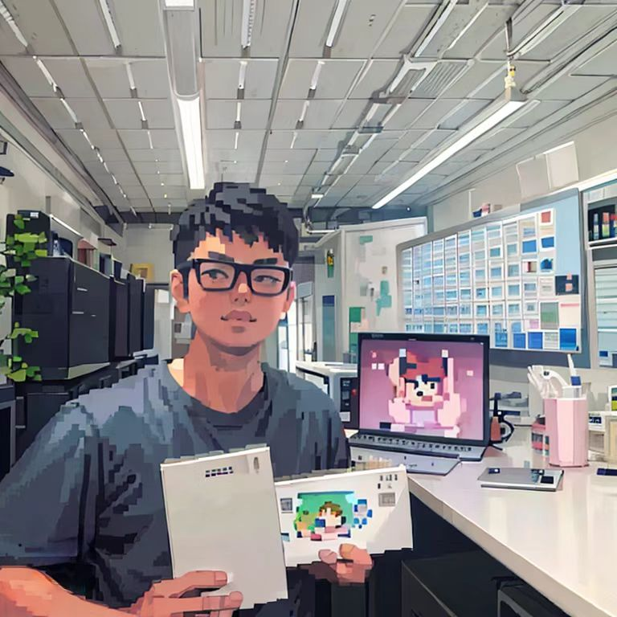
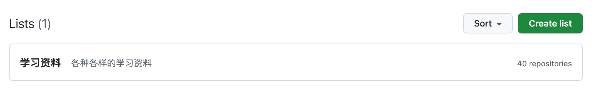

# 个人IP“肖恩杂谈”使用说明书v1.0
## 肖恩是谁？

肖恩是一名后端程序员，对通过技术实现个人价值有着深厚的热情。擅长将复杂问题分解为可执行的步骤，并且喜欢完成任务时的成就感。

## 为什么做个人IP？
在MT、JD等互联网公司有过5年工作经历，在那里磨练了我设计和实现复杂业务系统的能力。大规模互联网项目的经验不仅提高了我的技术洞察力，也丰富了我对互联网应用多样性的理解。但大公司同样也对我的发展有了一些限制，我不愿意走业务架构或者技术管理的路线，领导给我的规划却往往是这样，因为大多数的场景还是更重业务属性，这条路会容易些。

做个人IP其实是想探索自我更多的可能性，如果职业生涯一眼就能望到头，通过阅读、学习、分享和交流得到更多的信息，是否可以走出一条不同的路。同时我在"[工作五年小结 | 面对不确定性快速上升的外部环境，我们该如何寻求突破？](https://juejin.cn/post/7409467432899428403)"一文中提到在这个复杂性快速上升的21世纪，面对不确定性上升的外部环境，我们该如何寻求突破呢？我的答案是：**持续学习，制造正反馈，相信复利效应**。这也是践行我理论的一种方式，因此做个人IP没有风险，只要坚持就会有回报，只是多少的差异而已。

## 提供哪些内容？
从去年10月尝试写博文，并把日常想法点滴进行记录，经过小一年时间的积累，目前有了三个主题：

### 技术周刊
写周刊的目的是提高知识的留存率，并带来各种正反馈。主要对一周内阅读的资讯或技术内容精品（个人向）进行总结，分类大致包含“业界资讯”、“技术博客”、“开源项目”和“工具分享”等。为减少阅读负担提高记忆留存率，每类下内容数一般不超过3条。

往期内容查看👉🏻 [肖恩技术周刊](https://mp.weixin.qq.com/mp/appmsgalbum?__biz=MzkwODY0ODQzOQ==&action=getalbum&album_id=3492416248238096386#wechat_redirect)

### 提效工具
懒惰是程序员的美德，但背后体现了对效率极致的追求，大模型的出现进一步为提效提供了更多可能性。这个主题会持续收集提效工具，并提供详细的使用说明。

往期内容查看👉🏻 [提效工具](https://mp.weixin.qq.com/mp/appmsgalbum?__biz=MzkwODY0ODQzOQ==&action=getalbum&album_id=3508413914134659081#wechat_redirect)

### 技术专栏
技术专栏是对某一特定领域深入挖掘后的产物，具有较高的干货性质，但这一部分的需要长时间的积累产出会较慢。市面上有较多针对“架构设计”、“分布式理论”、“中间件原理”和“语言核心”的技术专栏，避免雷同如无真金白银就不献丑了。

目前提供了“代码可视化”专栏，这是我近两年持续探索的领域。代码可视是通过使用架构图、依赖图、分布式追踪、类图、火焰图和调用图等图形工具，在某些方面改变代码的可观察性。目的是帮助开发者理解和管理代码库，甚至自动化重构代码。

产出有一本未写完的GitBook《[Code Visualization](https://xiexiao064.gitbook.io/code-visualization)》，感兴趣的朋友可以先睹为快，提提建议。

## 未来规划
目前有一些新想法暂时没有实际的产出，在不久的未来会落地（应该吧😁）。
### 学习资料
收集了很多学习资料，这部分后面分类汇总好了再分享给大家。

### IT历史考究
不知道大家对IT的历史是否感兴趣，比如世界上著名的程序员都有哪些，他们的身平事迹，给IT界的发展带来了哪些实质性的贡献。或者一些我们使用的产品是如何诞生的，一些重要的语言是怎么发明出来的，背后是否有一段不为人知的故事。亦或是某些八卦😁。

## 与我交流
大家如果对我提供的内容感兴趣或有新的点子和建议都可以与我交流，广结善缘，哈哈。

