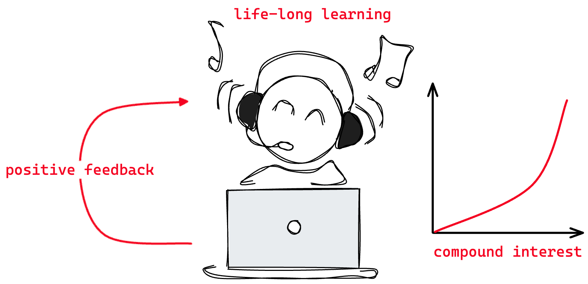
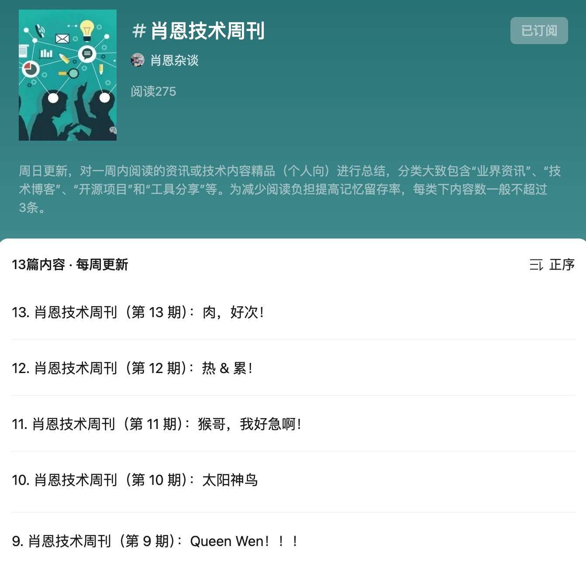
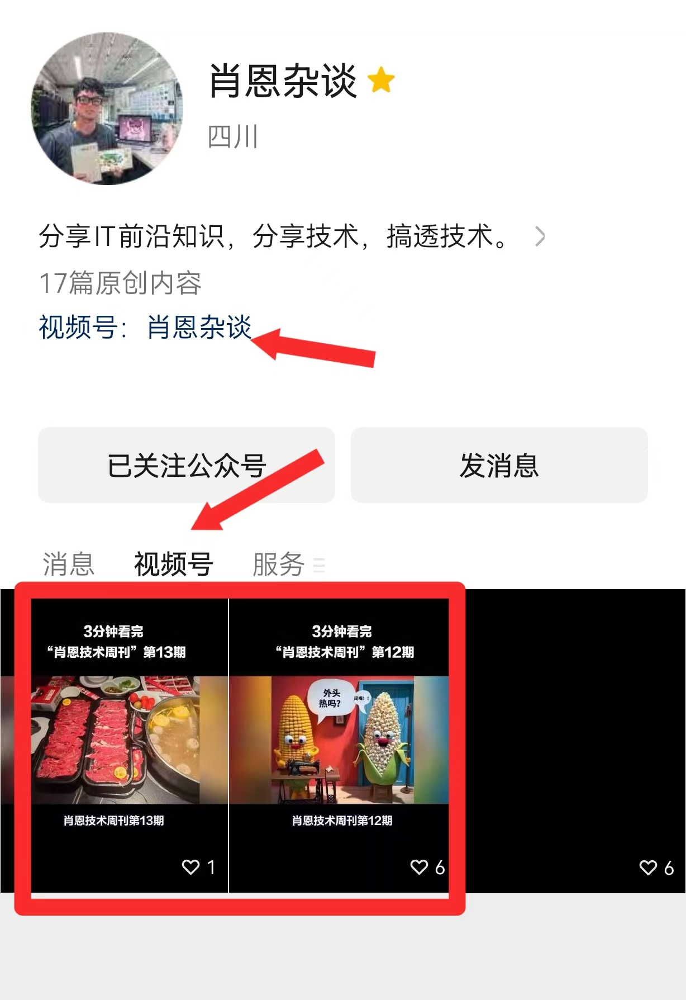
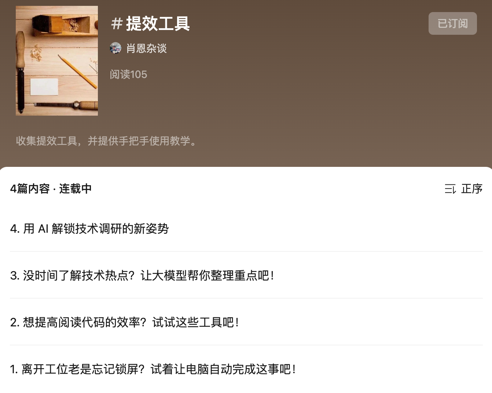
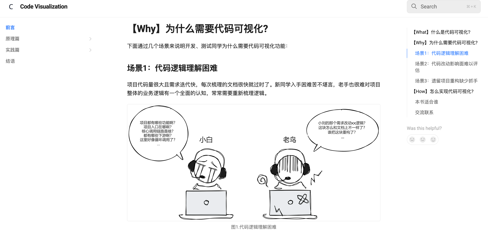
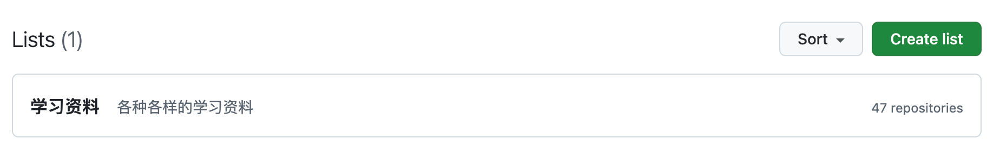

# 现在才开始探索个人IP是不是晚了？
## 先说服自己
现在开始探索个人IP是不是晚了？这赛道已经是一片红海了，前两年大量出现的离职博主，到如今很多也开始老老实实回去上班了😭。如今想快速通过个人IP赚米难如登天（和直播一样头部效应也很明显），但如果把打造IP看成一件长期的事，在维持一份基本的工作之外，不过与急功近利，慢慢打磨内容，降低预期后或许能得到意想不到的收获。（但行好事莫问前程？食饼🤡）

我在MT、JD等互联网公司有过5年后端开发工作经历，在那里磨练了我设计和实现复杂业务系统的能力。大规模互联网项目的经验不仅提高了我的技术洞察力，也丰富了我对互联网应用多样性的理解。但大公司同样也对我的发展有了一些限制，我不愿意走业务架构或者技术管理的路线，领导给我的规划却往往是这样，因为大多数的场景还是更重业务属性，这条路会容易些。

现在才开始做内容看起来有点晚了，错过了最佳时机。但俗话说“种一棵树最好是十年前其次是现在”，做个人IP其实是想探索自我更多的可能性，如果职业生涯一眼就能望到头（还有35岁这道坎），通过阅读、学习、分享和交流得到更多的信息，是否可以走出一条不同的路？同时我在"[工作五年小结 | 面对不确定性快速上升的外部环境，我们该如何寻求突破？](./think/five-years.md)"一文中提到在这个复杂性快速上升的21世纪，面对不确定性上升的外部环境，我们该如何寻求突破呢？我的答案是：**持续学习，制造正反馈，相信复利效应**。这也是践行我理论的一种方式，因此做个人IP没有风险，只要坚持就会有回报，只是多少的差异而已。

## 搞什么内容？
基于上述想法，我从去年10月开始写博文，把日常见闻和点滴想法进行记录，并于今年6月基于拓宽视野和分享交流的初衷创造了“**肖恩杂谈**”，用来分享内容并收集反馈。经过3个月时间的积累，虽然粉丝还未破百（现在关注就是初创粉啦！），但内容上已经有了三个明确的主题：

### 主题一：技术周刊
写周刊的目的是提高知识的留存率，并带来各种正反馈。主要对一周内阅读的资讯或技术内容精品（个人向，偏后端）进行总结，分类大致包含“业界资讯”、“技术博客”、“开源项目”和“工具分享”等。为减少阅读负担提高记忆留存率，每类下内容数一般不超过3条。周刊的形式和内容都还在不断地优化中，如果每周没有时间阅读资讯和文章，那么可以来吃一下我的阅读红利，虽然是二手但总比没有强😄。

合集查看👉🏻 [肖恩技术周刊](https://mp.weixin.qq.com/mp/appmsgalbum?__biz=MzkwODY0ODQzOQ==&action=getalbum&album_id=3492416248238096386#wechat_redirect)

除了文字形式目前也提供了“3分钟读周刊”视频，方便哪些更没空的朋友喝点汤。

### 主题二：提效专题
懒惰是程序员的美德，背后体现了对效率极致的追求，大模型的出现进一步为提效提供了更多可能性。这个主题会持续收集提效工具和方法，并提供详细的使用说明。

合集查看👉🏻 [提效专题](https://mp.weixin.qq.com/mp/appmsgalbum?__biz=MzkwODY0ODQzOQ==&action=getalbum&album_id=3508413914134659081#wechat_redirect)

### 主题三：技术专栏
技术专栏是对某一特定领域深入挖掘后的产物，具有较高的干货性质，但这一部分的需要长时间的积累产出会较慢。市面上有较多针对“架构设计”、“分布式理论”、“中间件原理”和“编程语言”的技术专栏，避免雷同如无真金白银就不献丑了。

目前提供了“代码可视化”专栏，这是我近两年持续探索的领域。代码可视化是通过使用架构图、依赖图、分布式追踪、类图、火焰图和调用图等图形工具，在某些方面改变代码的可观测性。目的是帮助开发者理解和管理代码库，甚至自动化重构代码。

产出有一本未写完的GitBook《[Code Visualization](https://xiexiao064.gitbook.io/code-visualization)》，感兴趣的朋友可以先睹为快，提提建议。

## 未来规划
目前有一些新想法暂时没有实际的产出，在不久的未来会落地。（应该吧🕊咕咕~）

### 学习资料
收集了很多学习资料，这部分后面分类汇总好了再分享给大家。（很多朋友更想要这种干干的东西吧😏，私信我可以提前获取）

### IT历史考究
不知道大家对IT的历史是否感兴趣，比如世界上著名的程序员都有哪些，他们的身平事迹，给IT界的发展带来了哪些实质性的贡献。或者一些我们使用的产品是如何诞生的，一些重要的语言是怎么发明出来的，背后是否有一段不为人知的故事。亦或是某些八卦🐶。

### 个人见解
一些工作生活中的见解和观点，尽量就事论事，不悯天忧人和发无谓的牢骚。内容类似于“[工作五年小结 | 面对不确定性快速上升的外部环境，我们该如何寻求突破？](./think/five-years.md)”这篇文章。

## 广结善缘
大家如果有不同的看法，或者对我提供的内容感兴趣或有新的点子和建议都可以与我交流，广结善缘，哈哈。

